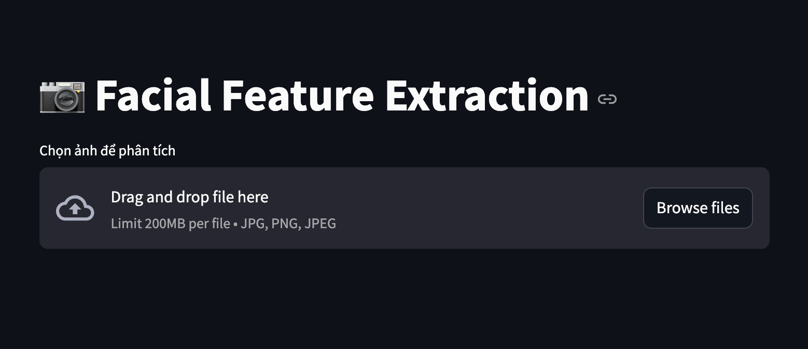

# 🚀 Facial Extraction Project

## 📌 Introduction
This project focuses on **facial feature extraction** using deep learning models. It employs **YOLO for head detection** and **ResNet for facial feature extraction**. The application is built with **Streamlit** for a user-friendly interface.

---

## 🛠 Installation

### 🔹 1. Clone the Project
```bash
git clone https://github.com/DucBox/Facial-Extraction.git
cd Facial-Extraction
```

### 🔹 2. Install Dependencies
```bash
pip install -r requirements.txt
```

---

## 🔥 Configuration
All configurations are located in `src/config.py`. You need to update the **model paths** before running the application.

### 🔹 1. Modify Model Paths in `config.py`
Update the model paths in `src/config.py`:
```python
MODEL_YOLO_PATH = os.path.join(BASE_DIR, "../models/head_detect.pt")
MODEL_RESNET_PATH = os.path.join(BASE_DIR, "../models/facial_extract.h5")
```

Make sure the **model files** are placed correctly in the `models/` directory.

---

## 🚀 Running the Application

### 🔹 1. Run Locally
```bash
streamlit run frontend/app_streamlit.py
```
Access the application at `http://localhost:8501`



---

## 📜 License & Author
- 📌 **Author:** DucBox
- 📌 **Contact:** quangducngo0811@gmail.com

🚀 Happy coding! 🎉

